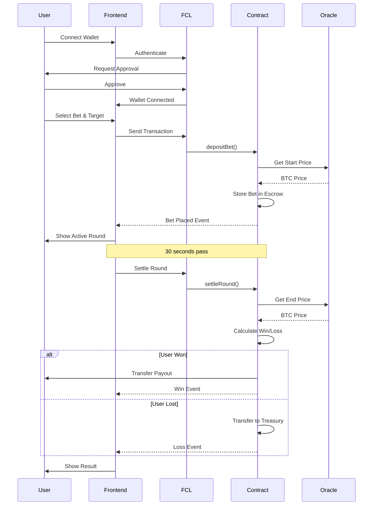

# Design Document: Overflow - BTC Price Prediction Game

## Overview

Overflow is a decentralized real-time BTC price prediction game built on Flow Blockchain. The system consists of three main layers:

1. **Smart Contract Layer (Cadence)**: Manages deposits, escrow, oracle integration, win/loss determination, and payouts
2. **Frontend Layer (Next.js)**: Provides the user interface with live chart visualization, betting interface, and wallet integration
3. **Oracle Layer**: Supplies tamper-proof BTC price feeds for game resolution

The game operates in discrete rounds where users bet FLOW tokens on specific price movement targets. Each target has an associated multiplier (e.g., x2, x3, x10). When a round ends after 30 seconds, the smart contract queries the oracle to determine if the actual price movement matches the user's prediction, then automatically processes the payout.

**Key Design Principles:**
- Security-first: All funds held in escrow with reentrancy protection
- Trustless: Oracle-based price verification ensures fair outcomes
- User experience: Smooth animations, clear feedback, and responsive UI
- Modularity: Clean separation between contract logic, state management, and UI components

## Architecture

### System Architecture Diagram

```mermaid
graph TB
    subgraph "Frontend Layer"
        UI[Next.js UI Components]
        State[Zustand State Store]
        FCL[Flow Client Library]
        Chart[Chart Component]
    end
    
    subgraph "Blockchain Layer"
        Contract[Overflow Smart Contract]
        FlowToken[FlowToken Contract]
        Oracle[Oracle Contract/Service]
    end
    
    subgraph "External Services"
        Pyth[Pyth Network]
        Wallet[Flow Wallets]
    end
    
    UI --> State
    State --> FCL
    FCL --> Wallet
    FCL --> Contract
    Contract --> FlowToken
    Contract --> Oracle
    Oracle --> Pyth
    Chart --> State
    
    style Contract fill:#ff006e
    style UI fill:#0a0a0a
    style Oracle fill:#00f5ff
```



### Component Interaction Flow



## Components and Interfaces

### 1. Smart Contract Components

#### 1.1 Main Contract: OverflowGame

**Purpose**: Core game logic managing bets, rounds, and payouts

**Resources:**

```cadence
// Bet resource representing a single wager
pub resource Bet {
    pub let id: UInt64
    pub let player: Address
    pub let amount: UFix64
    pub let targetCell: TargetCell
    pub let multiplier: UFix64
    pub let startPrice: UFix64
    pub let startTime: UFix64
    pub let endTime: UFix64
    pub var settled: Bool
    
    init(
        player: Address,
        amount: UFix64,
        targetCell: TargetCell,
        multiplier: UFix64,
        startPrice: UFix64
    )
}

// Admin resource for contract management
pub resource Admin {
    pub fun updateOracleAddress(newAddress: Address)
    pub fun withdrawTreasury(amount: UFix64, recipient: Address)
    pub fun pauseGame()
    pub fun resumeGame()
}
```

**Structs:**

```cadence
// Target cell definition
pub struct TargetCell {
    pub let id: UInt8
    pub let priceChange: Fix64  // e.g., +10.0 for "$10 up"
    pub let direction: Direction // UP or DOWN
    pub let timeframe: UFix64    // 30 seconds
    
    pub enum Direction: UInt8 {
        pub case UP
        pub case DOWN
    }
}

// Bet result
pub struct BetResult {
    pub let betId: UInt64
    pub let won: Bool
    pub let actualPriceChange: Fix64
    pub let payout: UFix64
    pub let timestamp: UFix64
}
```

**Public Functions:**

```cadence
// Place a new bet
pub fun placeBet(
    payment: @FlowToken.Vault,
    targetCell: TargetCell,
    multiplier: UFix64
): UInt64

// Settle a completed round
pub fun settleRound(betId: UInt64): BetResult

// Query bet status
pub fun getBetStatus(betId: UInt64): BetStatus

// Get available target cells with multipliers
pub fun getTargetCells(): [TargetCellInfo]
```

**Events:**

```cadence
pub event BetPlaced(
    betId: UInt64,
    player: Address,
    amount: UFix64,
    targetCell: TargetCell,
    multiplier: UFix64,
    startPrice: UFix64,
    startTime: UFix64
)

pub event RoundSettled(
    betId: UInt64,
    player: Address,
    won: Bool,
    actualPriceChange: Fix64,
    payout: UFix64
)

pub event PayoutTransferred(
    betId: UInt64,
    recipient: Address,
    amount: UFix64
)
```

#### 1.2 Oracle Interface

**Purpose**: Abstract interface for price feed integration

```cadence
pub contract interface IPriceOracle {
    // Get current BTC price in USD
    pub fun getCurrentPrice(): UFix64
    
    // Get price with timestamp validation
    pub fun getPriceWithTimestamp(): PriceData
    
    // Validate price freshness (within 60 seconds)
    pub fun isPriceFresh(timestamp: UFix64): Bool
    
    pub struct PriceData {
        pub let price: UFix64
        pub let timestamp: UFix64
        pub let confidence: UFix64
    }
}
```

**Implementation Note**: For MVP, we'll implement a mock oracle for emulator testing. Production will integrate with Pyth Network or Chainlink when available on Flow.

#### 1.3 Treasury Management

**Purpose**: Manage house funds and payouts

```cadence
pub resource Treasury {
    // Vault holding lost bets
    access(self) let vault: @FlowToken.Vault
    
    // Deposit lost bet funds
    pub fun deposit(from: @FlowToken.Vault)
    
    // Withdraw for payouts (admin only)
    pub fun withdraw(amount: UFix64): @FlowToken.Vault
    
    // Get current balance
    pub fun getBalance(): UFix64
}
```

### 2. Frontend Components

#### 2.1 Application Structure

```
src/
├── app/
│   ├── layout.tsx              # Root layout with providers
│   ├── page.tsx                # Main game page
│   └── globals.css             # Global styles
├── components/
│   ├── game/
│   │   ├── GameBoard.tsx       # Main game container
│   │   ├── LiveChart.tsx       # BTC price chart
│   │   ├── TargetGrid.tsx      # Betting target cells
│   │   ├── BetControls.tsx     # Bet amount input
│   │   ├── ActiveRound.tsx     # Current round display
│   │   └── RoundTimer.tsx      # Countdown timer
│   ├── wallet/
│   │   ├── WalletConnect.tsx   # Wallet connection button
│   │   └── WalletInfo.tsx      # Balance display
│   ├── history/
│   │   ├── BetHistory.tsx      # Historical bets list
│   │   └── BetCard.tsx         # Individual bet display
│   └── ui/
│       ├── Button.tsx          # Reusable button
│       ├── Card.tsx            # Card container
│       └── Modal.tsx           # Modal dialog
├── lib/
│   ├── flow/
│   │   ├── config.ts           # FCL configuration
│   │   ├── transactions.ts     # Transaction builders
│   │   ├── scripts.ts          # Query scripts
│   │   └── events.ts           # Event listeners
│   ├── store/
│   │   ├── index.ts            # Zustand store setup
│   │   ├── walletSlice.ts      # Wallet state
│   │   ├── gameSlice.ts        # Game state
│   │   └── historySlice.ts     # Bet history state
│   └── utils/
│       ├── formatters.ts       # Number/date formatting
│       └── constants.ts        # App constants
└── types/
    ├── game.ts                 # Game type definitions
    ├── bet.ts                  # Bet type definitions
    └── flow.ts                 # Flow-specific types
```

#### 2.2 Key Component Interfaces

**GameBoard Component:**

```typescript
interface GameBoardProps {
  // No props - uses global state
}

interface GameBoardState {
  selectedTarget: TargetCell | null;
  betAmount: string;
  isPlacingBet: boolean;
}
```

**LiveChart Component:**

```typescript
interface LiveChartProps {
  priceData: PricePoint[];
  activeTargets: TargetCell[];
  onTargetHit?: (targetId: string) => void;
}

interface PricePoint {
  timestamp: number;
  price: number;
}
```

**TargetGrid Component:**

```typescript
interface TargetGridProps {
  targets: TargetCellInfo[];
  selectedTarget: string | null;
  onSelectTarget: (targetId: string) => void;
  disabled: boolean;
}

interface TargetCellInfo {
  id: string;
  label: string;          // e.g., "+$10 in 30s"
  multiplier: number;     // e.g., 2.0 for x2
  priceChange: number;    // e.g., 10.0
  direction: 'UP' | 'DOWN';
}
```

#### 2.3 State Management (Zustand)

**Wallet Slice:**

```typescript
interface WalletState {
  address: string | null;
  balance: string;
  isConnected: boolean;
  isConnecting: boolean;
  
  connect: () => Promise<void>;
  disconnect: () => void;
  refreshBalance: () => Promise<void>;
}
```

**Game Slice:**

```typescript
interface GameState {
  currentPrice: number;
  priceHistory: PricePoint[];
  activeRound: ActiveRound | null;
  targetCells: TargetCellInfo[];
  
  placeBet: (amount: string, targetId: string) => Promise<void>;
  settleRound: (betId: string) => Promise<void>;
  updatePrice: (price: number) => void;
}

interface ActiveRound {
  betId: string;
  amount: string;
  target: TargetCellInfo;
  startPrice: number;
  startTime: number;
  endTime: number;
  status: 'active' | 'settling' | 'settled';
}
```

**History Slice:**

```typescript
interface HistoryState {
  bets: BetRecord[];
  isLoading: boolean;
  
  fetchHistory: () => Promise<void>;
  addBet: (bet: BetRecord) => void;
}

interface BetRecord {
  id: string;
  timestamp: number;
  amount: string;
  target: TargetCellInfo;
  startPrice: number;
  endPrice: number;
  actualChange: number;
  won: boolean;
  payout: string;
}
```

### 3. Flow Integration Layer

#### 3.1 FCL Configuration

```typescript
// lib/flow/config.ts
import * as fcl from "@onflow/fcl";

export const configureFlow = (network: 'emulator' | 'testnet' | 'mainnet') => {
  const configs = {
    emulator: {
      accessNode: "http://localhost:8888",
      discoveryWallet: "http://localhost:8701/fcl/authn",
      contractAddress: "0xf8d6e0586b0a20c7"
    },
    testnet: {
      accessNode: "https://rest-testnet.onflow.org",
      discoveryWallet: "https://fcl-discovery.onflow.org/testnet/authn",
      contractAddress: "0x..." // Deploy address
    },
    mainnet: {
      accessNode: "https://rest-mainnet.onflow.org",
      discoveryWallet: "https://fcl-discovery.onflow.org/authn",
      contractAddress: "0x..." // Deploy address
    }
  };
  
  const config = configs[network];
  
  fcl.config()
    .put("accessNode.api", config.accessNode)
    .put("discovery.wallet", config.discoveryWallet)
    .put("0xOverflowGame", config.contractAddress);
};
```

#### 3.2 Transaction Templates

```typescript
// lib/flow/transactions.ts

export const placeBetTransaction = (
  amount: string,
  targetCellId: string,
  multiplier: string
) => `
import OverflowGame from 0xOverflowGame
import FlowToken from 0xFlowToken
import FungibleToken from 0xFungibleToken

transaction(amount: UFix64, targetCellId: UInt8, multiplier: UFix64) {
  let paymentVault: @FungibleToken.Vault
  let gameRef: &OverflowGame
  
  prepare(signer: AuthAccount) {
    // Withdraw FLOW tokens
    let vaultRef = signer.borrow<&FlowToken.Vault>(from: /storage/flowTokenVault)
      ?? panic("Could not borrow FlowToken.Vault")
    
    self.paymentVault <- vaultRef.withdraw(amount: amount)
    
    // Get game reference
    self.gameRef = getAccount(0xOverflowGame)
      .getCapability<&OverflowGame>(OverflowGame.GamePublicPath)
      .borrow()
      ?? panic("Could not borrow OverflowGame reference")
  }
  
  execute {
    // Create target cell
    let targetCell = OverflowGame.TargetCell(
      id: targetCellId,
      priceChange: self.getTargetPriceChange(targetCellId),
      direction: self.getTargetDirection(targetCellId),
      timeframe: 30.0
    )
    
    // Place bet
    let betId = self.gameRef.placeBet(
      payment: <-self.paymentVault,
      targetCell: targetCell,
      multiplier: multiplier
    )
    
    log("Bet placed with ID: ".concat(betId.toString()))
  }
}
`;

export const settleRoundTransaction = (betId: string) => `
import OverflowGame from 0xOverflowGame

transaction(betId: UInt64) {
  let gameRef: &OverflowGame
  
  prepare(signer: AuthAccount) {
    self.gameRef = getAccount(0xOverflowGame)
      .getCapability<&OverflowGame>(OverflowGame.GamePublicPath)
      .borrow()
      ?? panic("Could not borrow OverflowGame reference")
  }
  
  execute {
    let result = self.gameRef.settleRound(betId: betId)
    
    if result.won {
      log("Round won! Payout: ".concat(result.payout.toString()))
    } else {
      log("Round lost. Better luck next time!")
    }
  }
}
`;
```

#### 3.3 Script Templates

```typescript
// lib/flow/scripts.ts

export const getBalanceScript = (address: string) => `
import FlowToken from 0xFlowToken
import FungibleToken from 0xFungibleToken

pub fun main(address: Address): UFix64 {
  let account = getAccount(address)
  let vaultRef = account.getCapability(/public/flowTokenBalance)
    .borrow<&FlowToken.Vault{FungibleToken.Balance}>()
    ?? panic("Could not borrow Balance reference")
  
  return vaultRef.balance
}
`;

export const getBetStatusScript = (betId: string) => `
import OverflowGame from 0xOverflowGame

pub fun main(betId: UInt64): OverflowGame.BetStatus {
  let gameRef = getAccount(0xOverflowGame)
    .getCapability<&OverflowGame>(OverflowGame.GamePublicPath)
    .borrow()
    ?? panic("Could not borrow OverflowGame reference")
  
  return gameRef.getBetStatus(betId: betId)
}
`;

export const getTargetCellsScript = () => `
import OverflowGame from 0xOverflowGame

pub fun main(): [OverflowGame.TargetCellInfo] {
  let gameRef = getAccount(0xOverflowGame)
    .getCapability<&OverflowGame>(OverflowGame.GamePublicPath)
    .borrow()
    ?? panic("Could not borrow OverflowGame reference")
  
  return gameRef.getTargetCells()
}
`;
```

#### 3.4 Event Listeners

```typescript
// lib/flow/events.ts
import * as fcl from "@onflow/fcl";

export const subscribeToBetEvents = (
  contractAddress: string,
  onBetPlaced: (event: BetPlacedEvent) => void,
  onRoundSettled: (event: RoundSettledEvent) => void
) => {
  // Subscribe to BetPlaced events
  fcl.events(`A.${contractAddress}.OverflowGame.BetPlaced`)
    .subscribe((event) => {
      onBetPlaced(event.data);
    });
  
  // Subscribe to RoundSettled events
  fcl.events(`A.${contractAddress}.OverflowGame.RoundSettled`)
    .subscribe((event) => {
      onRoundSettled(event.data);
    });
};

interface BetPlacedEvent {
  betId: string;
  player: string;
  amount: string;
  targetCell: any;
  multiplier: string;
  startPrice: string;
  startTime: string;
}

interface RoundSettledEvent {
  betId: string;
  player: string;
  won: boolean;
  actualPriceChange: string;
  payout: string;
}
```

## Data Models

### Smart Contract Data Models

**Bet Storage:**
- Stored as resources in contract storage
- Each bet has unique ID (auto-incrementing UInt64)
- Indexed by player address for quick lookup
- Immutable once created (except settled flag)

**Treasury Storage:**
- Single resource stored in contract account
- Holds FlowToken.Vault resource
- Only accessible by Admin resource

**Oracle Price Data:**
- Fetched on-demand (not stored permanently)
- Cached for 60 seconds to reduce oracle calls
- Validated for freshness before use

### Frontend Data Models

**Price Data Storage:**
- In-memory array of last 300 price points (5 minutes at 1s intervals)
- Rolling window - oldest points removed as new ones arrive
- Persisted to sessionStorage for page refresh recovery

**Bet History Storage:**
- Fetched from blockchain events on load
- Cached in Zustand store
- Persisted to localStorage (last 50 bets)
- Refreshed on new bet placement

**Target Cell Configuration:**
- Static configuration loaded on app init
- Defines available betting targets and multipliers
- Example configuration:

```typescript
const TARGET_CELLS: TargetCellInfo[] = [
  { id: '1', label: '+$5 in 30s', multiplier: 1.5, priceChange: 5, direction: 'UP' },
  { id: '2', label: '+$10 in 30s', multiplier: 2.0, priceChange: 10, direction: 'UP' },
  { id: '3', label: '+$20 in 30s', multiplier: 3.0, priceChange: 20, direction: 'UP' },
  { id: '4', label: '+$50 in 30s', multiplier: 5.0, priceChange: 50, direction: 'UP' },
  { id: '5', label: '+$100 in 30s', multiplier: 10.0, priceChange: 100, direction: 'UP' },
  { id: '6', label: '-$5 in 30s', multiplier: 1.5, priceChange: -5, direction: 'DOWN' },
  { id: '7', label: '-$10 in 30s', multiplier: 2.0, priceChange: -10, direction: 'DOWN' },
  { id: '8', label: '-$20 in 30s', multiplier: 3.0, priceChange: -20, direction: 'DOWN' },
];
```

## Correctness Properties

*A property is a characteristic or behavior that should hold true across all valid executions of a system—essentially, a formal statement about what the system should do. Properties serve as the bridge between human-readable specifications and machine-verifiable correctness guarantees.*


### Property 1: Bet Amount Validation
*For any* bet amount and wallet balance, if the bet amount exceeds the wallet balance, the system should reject the bet and display both the required amount and current balance.
**Validates: Requirements 3.2, 12.3**

### Property 2: Active Round Prevention
*For any* user with an active round, attempting to place another bet should be rejected by both the frontend and smart contract.
**Validates: Requirements 3.5, 4.5**

### Property 3: Bet Data Persistence
*For any* successfully placed bet, the smart contract should store all required fields (amount, target cell, multiplier, start price, start timestamp) and these should be retrievable.
**Validates: Requirements 4.2**

### Property 4: Transaction Reversion on Failure
*For any* invalid deposit transaction (insufficient funds, invalid parameters, etc.), the smart contract should revert the transaction and return an error without changing state.
**Validates: Requirements 4.4, 13.3**

### Property 5: Oracle Price Freshness Validation
*For any* oracle price data with a timestamp older than 60 seconds, the smart contract should reject it and either refund the bet or prevent settlement.
**Validates: Requirements 5.3, 5.4**

### Property 6: Price Data Storage
*For any* settled bet, both the start price and end price should be stored on-chain and retrievable for transparency.
**Validates: Requirements 5.5**

### Property 7: Price Movement Calculation
*For any* start price and end price, the calculated price difference should equal (end price - start price) with correct sign for direction.
**Validates: Requirements 6.1, 6.2**

### Property 8: Bet Outcome Determination
*For any* bet with target price change T and actual price change A, the bet should be marked as won if and only if (A >= T for UP direction) or (A <= T for DOWN direction).
**Validates: Requirements 6.3, 6.4**

### Property 9: Payout Calculation and Transfer
*For any* winning bet with amount B and multiplier M, the payout should equal (B * M) and should be transferred from escrow to the user's wallet, while losing bets should transfer B to the treasury.
**Validates: Requirements 7.1, 7.2, 7.3**

### Property 10: Payout Retry on Failure
*For any* failed payout transfer, the system should allow the user to retry the claim without losing their winnings.
**Validates: Requirements 7.5**

### Property 11: Rolling Time Window
*For any* price data array in the chart component, after updates, it should only contain price points from the last 5 minutes (300 seconds).
**Validates: Requirements 2.4**

### Property 12: Target Cell Selection and Payout Display
*For any* selected target cell with multiplier M and bet amount B, the displayed potential payout should equal (B * M).
**Validates: Requirements 3.3**

### Property 13: Transaction Initiation
*For any* confirmed bet with valid amount and target, the system should initiate an FCL transaction with correct parameters (amount, target cell ID, multiplier).
**Validates: Requirements 3.4**

### Property 14: Wallet Session Restoration
*For any* authenticated wallet session stored in localStorage, on page load, the system should automatically restore the session and display the wallet address and balance.
**Validates: Requirements 1.5, 14.4**

### Property 15: Authentication Flow Triggering
*For any* wallet connection button click, the system should initiate the FCL authentication flow.
**Validates: Requirements 1.2**

### Property 16: Authentication Success Handling
*For any* successful wallet authentication, the system should display the user's wallet address and FLOW balance.
**Validates: Requirements 1.3**

### Property 17: Authentication Failure Handling
*For any* failed wallet authentication, the system should display an error message and provide a retry option.
**Validates: Requirements 1.4**

### Property 18: Round End Time Calculation
*For any* bet placed at start time T, the round end time should be set to (T + 30 seconds).
**Validates: Requirements 10.1**

### Property 19: Early Settlement Prevention
*For any* settlement attempt before the round end time, the smart contract should reject it.
**Validates: Requirements 10.2**

### Property 20: Settlement After End Time
*For any* round where current time >= end time, the smart contract should allow settlement with the final oracle price.
**Validates: Requirements 10.3**

### Property 21: Countdown Timer Accuracy
*For any* active round with end time E and current time C where C < E, the displayed countdown should show (E - C) seconds remaining.
**Validates: Requirements 10.4, 8.5**

### Property 22: Manual Settlement After Timeout
*For any* round where (current time - end time) > 5 minutes, the smart contract should allow the user to manually trigger settlement.
**Validates: Requirements 10.5**

### Property 23: Bet History Calculation
*For any* set of historical bets, the displayed total wins, losses, and net profit/loss should be correctly calculated from the bet outcomes and amounts.
**Validates: Requirements 9.4**

### Property 24: Bet History Filtering
*For any* filter selection (wins, losses, active), only bets matching that outcome should be displayed in the history list.
**Validates: Requirements 9.5**

### Property 25: Historical Bet Details
*For any* historical bet clicked by the user, the detail view should display the start price, end price, and actual price movement.
**Validates: Requirements 9.2**

### Property 26: Blockchain Event Fetching
*For any* user address, the system should fetch and display bet history from BetPlaced and RoundSettled events emitted by the smart contract.
**Validates: Requirements 9.3**

### Property 27: Transaction Error Display
*For any* failed transaction, the system should display a user-friendly error message explaining the failure reason.
**Validates: Requirements 12.1**

### Property 28: Oracle Unavailability Handling
*For any* oracle service failure, the system should display a warning and disable bet placement.
**Validates: Requirements 12.2**

### Property 29: Loading State Display
*For any* transaction in progress, the system should display a loading indicator until the transaction completes or fails.
**Validates: Requirements 12.4**

### Property 30: Transaction Retry Availability
*For any* failed transaction, the system should provide a retry button or option.
**Validates: Requirements 12.5**

### Property 31: Bet Owner Authorization
*For any* settlement attempt, the smart contract should validate that the caller is the bet owner and reject unauthorized attempts.
**Validates: Requirements 13.1**

### Property 32: Administrative Access Control
*For any* administrative function call (update oracle, withdraw treasury, pause game), the smart contract should validate that the caller has admin privileges and reject unauthorized attempts.
**Validates: Requirements 13.4**

### Property 33: State Change Event Emission
*For any* state-changing operation (bet placement, settlement, payout), the smart contract should emit an appropriate event with relevant data.
**Validates: Requirements 4.3, 6.5, 7.4, 13.5**

### Property 34: Blockchain Event State Synchronization
*For any* blockchain event received (BetPlaced, RoundSettled, PayoutTransferred), the frontend state should automatically update to reflect the new data.
**Validates: Requirements 14.3**

### Property 35: Network Configuration Switching
*For any* network selection (emulator, testnet, mainnet), the system should apply the correct configuration (access node URL, contract addresses, discovery wallet).
**Validates: Requirements 15.5**

## Error Handling

### Smart Contract Error Handling

**Input Validation Errors:**
- Invalid bet amount (zero, negative, or exceeds balance)
- Invalid target cell ID
- Invalid multiplier value
- Return descriptive error messages using Cadence's panic() with clear text

**State Errors:**
- User already has active bet
- Bet ID not found
- Bet already settled
- Round not yet ended (early settlement attempt)
- Use pre-condition checks and revert with specific error messages

**Oracle Errors:**
- Oracle price data stale (timestamp > 60 seconds old)
- Oracle unavailable or returns invalid data
- Fallback: Refund bet to user, emit RefundIssued event

**Transfer Errors:**
- Insufficient contract balance for payout
- Recipient vault not found
- Allow retry mechanism - store payout claim in contract state
- User can call claimPayout() to retry

**Access Control Errors:**
- Non-owner attempting to settle bet
- Non-admin attempting administrative functions
- Use Cadence's access control modifiers and capability-based security

### Frontend Error Handling

**Wallet Connection Errors:**
- User rejects connection: Display "Connection rejected" with retry button
- Wallet extension not installed: Display installation instructions
- Network mismatch: Prompt user to switch networks

**Transaction Errors:**
- Insufficient balance: Display required vs. available balance
- Transaction rejected: Display reason and retry option
- Transaction timeout: Display status and allow checking transaction ID
- Gas estimation failure: Suggest reducing bet amount

**Network Errors:**
- RPC node unavailable: Display "Network unavailable" and retry
- Slow response: Show loading state with timeout (30 seconds)
- Fallback to alternative RPC endpoints if configured

**Oracle Errors:**
- Price feed unavailable: Disable bet placement, show warning banner
- Stale price data: Display last update time, warn user
- Automatic retry every 10 seconds in background

**State Errors:**
- Active round exists: Disable bet placement, show active round
- Invalid bet amount: Display validation error inline
- Target not selected: Disable confirm button, show prompt

**Error Display Patterns:**
- Toast notifications for transient errors (network, transaction)
- Modal dialogs for critical errors requiring user action
- Inline validation messages for form inputs
- Banner warnings for system-wide issues (oracle down)

## Testing Strategy

### Dual Testing Approach

The Overflow system requires both unit testing and property-based testing for comprehensive coverage:

**Unit Tests** focus on:
- Specific examples and edge cases
- Integration points between components
- UI component rendering and interactions
- Error conditions with specific inputs

**Property-Based Tests** focus on:
- Universal properties that hold for all inputs
- Comprehensive input coverage through randomization
- Contract invariants and business rules
- Mathematical properties (calculations, comparisons)

Both testing approaches are complementary and necessary. Unit tests catch concrete bugs with known inputs, while property tests verify general correctness across the input space.

### Smart Contract Testing

**Framework**: Cadence Testing Framework + Flow Emulator

**Property-Based Testing Library**: Use Cadence's built-in testing capabilities with randomized inputs

**Test Configuration**:
- Minimum 100 iterations per property test
- Each property test must reference its design document property
- Tag format: `// Feature: overflow, Property N: [property text]`

**Test Categories:**

1. **Bet Placement Tests**
   - Property tests for bet validation (Property 1, 2, 3, 4)
   - Unit tests for specific invalid inputs (zero amount, negative amount)
   - Edge cases: maximum bet amount, minimum bet amount

2. **Oracle Integration Tests**
   - Property tests for price freshness validation (Property 5, 6)
   - Unit tests with mock oracle returning specific prices
   - Edge cases: exactly 60 seconds old, oracle returns zero

3. **Win/Loss Determination Tests**
   - Property tests for outcome calculation (Property 7, 8)
   - Unit tests for boundary conditions (exact match, off by 1)
   - Edge cases: zero price change, extreme price movements

4. **Payout Tests**
   - Property tests for payout calculation and routing (Property 9, 10)
   - Unit tests for specific multipliers and amounts
   - Edge cases: maximum payout, minimum payout, failed transfer retry

5. **Time Management Tests**
   - Property tests for round timing (Property 18, 19, 20, 22)
   - Unit tests for specific time scenarios
   - Edge cases: exactly at end time, just before end time

6. **Access Control Tests**
   - Property tests for authorization (Property 31, 32)
   - Unit tests for each protected function
   - Edge cases: admin vs. non-admin, owner vs. non-owner

7. **Event Emission Tests**
   - Property test for all state changes emit events (Property 33)
   - Unit tests verifying event data correctness
   - Edge cases: multiple events in single transaction

**Example Property Test Structure:**

```cadence
// Feature: overflow, Property 9: Payout Calculation and Transfer
// For any winning bet with amount B and multiplier M, the payout should equal (B * M)
access(all) fun testPayoutCalculation() {
    // Run 100 iterations with random inputs
    for i in 0..<100 {
        let betAmount = randomUFix64(min: 0.1, max: 1000.0)
        let multiplier = randomUFix64(min: 1.5, max: 10.0)
        let expectedPayout = betAmount * multiplier
        
        // Place bet and win
        let betId = placeBetAndWin(amount: betAmount, multiplier: multiplier)
        
        // Verify payout
        let actualPayout = getPayoutAmount(betId: betId)
        Test.assertEqual(expectedPayout, actualPayout)
    }
}
```

### Frontend Testing

**Frameworks**: 
- Jest + React Testing Library for unit tests
- Playwright for E2E tests
- fast-check for property-based testing in TypeScript

**Test Configuration**:
- Minimum 100 iterations per property test
- Each property test must reference its design document property
- Tag format: `// Feature: overflow, Property N: [property text]`

**Test Categories:**

1. **Wallet Integration Tests**
   - Property tests for authentication flow (Property 15, 16, 17)
   - Property test for session restoration (Property 14)
   - Unit tests for specific wallet providers (Blocto, Lilico)
   - Mock FCL for isolated testing

2. **Chart Component Tests**
   - Property test for rolling time window (Property 11)
   - Property test for countdown timer (Property 21)
   - Unit tests for chart rendering with specific data
   - Edge cases: empty data, single data point, large dataset

3. **Betting Interface Tests**
   - Property tests for validation (Property 1, 2)
   - Property tests for payout display (Property 12)
   - Property test for transaction initiation (Property 13)
   - Unit tests for UI interactions (click, input)
   - Edge cases: boundary values, rapid clicking

4. **Bet History Tests**
   - Property tests for calculations and filtering (Property 23, 24, 25, 26)
   - Unit tests for specific bet records
   - Edge cases: empty history, large history, mixed outcomes

5. **Error Handling Tests**
   - Property tests for error display (Property 27, 28, 29, 30)
   - Unit tests for each error type
   - Edge cases: multiple simultaneous errors, error recovery

6. **State Management Tests**
   - Property test for event synchronization (Property 34)
   - Unit tests for each state slice
   - Edge cases: rapid state updates, conflicting updates

7. **Configuration Tests**
   - Property test for network switching (Property 35)
   - Unit tests for each network configuration
   - Edge cases: invalid network, missing configuration

**Example Property Test Structure:**

```typescript
// Feature: overflow, Property 11: Rolling Time Window
// For any price data array, after updates, it should only contain points from the last 5 minutes
import fc from 'fast-check';

describe('Chart Component - Rolling Time Window', () => {
  it('maintains 5-minute rolling window', () => {
    fc.assert(
      fc.property(
        fc.array(fc.record({
          timestamp: fc.integer({ min: 0, max: Date.now() }),
          price: fc.float({ min: 10000, max: 100000 })
        })),
        (pricePoints) => {
          const chart = new ChartComponent();
          
          // Add all price points
          pricePoints.forEach(point => chart.addPricePoint(point));
          
          // Get current data
          const currentData = chart.getPriceData();
          const now = Date.now();
          const fiveMinutesAgo = now - (5 * 60 * 1000);
          
          // Verify all points are within 5 minutes
          return currentData.every(point => point.timestamp >= fiveMinutesAgo);
        }
      ),
      { numRuns: 100 }
    );
  });
});
```

### Integration Testing

**Test Scenarios:**

1. **End-to-End Bet Flow**
   - Connect wallet → Place bet → Wait 30s → Settle → Verify payout
   - Test on Flow emulator with mock oracle
   - Verify all events emitted correctly

2. **Multiple Concurrent Bets**
   - Multiple users placing bets simultaneously
   - Verify no race conditions or state corruption
   - Test treasury balance remains consistent

3. **Oracle Failure Recovery**
   - Simulate oracle downtime during active round
   - Verify refund mechanism works
   - Verify system recovers when oracle returns

4. **Network Switching**
   - Switch between emulator, testnet, mainnet
   - Verify correct contract addresses used
   - Verify wallet reconnection works

### Test Data Generation

**For Property-Based Tests:**

**Bet Amounts**: Generate random UFix64 values between 0.1 and 1000.0 FLOW

**Multipliers**: Generate from predefined set [1.5, 2.0, 3.0, 4.0, 5.0, 6.0, 8.0, 10.0]

**Target Cells**: Generate random selections from available target cells

**Prices**: Generate random BTC prices between $10,000 and $100,000

**Price Changes**: Generate random changes between -$500 and +$500

**Timestamps**: Generate random timestamps within valid ranges

**Addresses**: Generate random Flow addresses for multi-user scenarios

### Continuous Integration

**CI Pipeline:**
1. Run all unit tests (frontend + contracts)
2. Run all property-based tests (100 iterations each)
3. Deploy contracts to emulator
4. Run integration tests
5. Generate coverage report (target: >80% coverage)
6. Run E2E tests with Playwright

**Test Execution Time Targets:**
- Unit tests: < 2 minutes
- Property tests: < 5 minutes
- Integration tests: < 3 minutes
- E2E tests: < 5 minutes
- Total CI time: < 15 minutes

### Manual Testing Checklist

**Before Each Release:**
- [ ] Test on Flow emulator with mock oracle
- [ ] Test on Flow testnet with real oracle
- [ ] Test with multiple wallet providers (Blocto, Lilico)
- [ ] Test on different browsers (Chrome, Firefox, Safari)
- [ ] Test on mobile devices (iOS, Android)
- [ ] Verify all animations and transitions
- [ ] Test error scenarios (network down, oracle down, insufficient balance)
- [ ] Verify bet history accuracy
- [ ] Test with extreme values (very large bets, very small bets)
- [ ] Verify gas costs are reasonable

## Implementation Notes

### Cadence Best Practices

Based on Flow blockchain development standards ([source](https://developers.flow.com/build/smart-contracts/best-practices/project-development-tips)):

1. **Use Standard Contracts**: Import official FungibleToken and FlowToken contracts rather than implementing from scratch
2. **Resource-Oriented Programming**: Leverage Cadence's resource types for bet management and treasury
3. **Capability-Based Security**: Use capabilities for access control rather than address checks
4. **Event Emission**: Emit events for all state changes to enable frontend tracking
5. **Pre and Post Conditions**: Use Cadence's built-in assertion system for invariant checking

### Oracle Integration Strategy

Since Pyth Network and Chainlink may not be fully available on Flow yet, the implementation strategy is:

**Phase 1 (MVP - Emulator)**:
- Implement mock oracle contract with manual price updates
- Admin can set BTC price for testing
- Sufficient for development and testing

**Phase 2 (Testnet)**:
- Integrate with available oracle solution on Flow testnet
- If Pyth/Chainlink unavailable, use HTTP oracle with signed price feeds
- Implement price feed validation and staleness checks

**Phase 3 (Mainnet)**:
- Integrate with production-grade oracle (Pyth Network preferred)
- Implement fallback oracle for redundancy
- Add oracle health monitoring

### Performance Considerations

**Frontend Optimization:**
- Use React.memo for chart component to prevent unnecessary re-renders
- Implement virtual scrolling for bet history with large datasets
- Debounce price updates to max 1 per second
- Use Web Workers for heavy calculations (bet history aggregation)

**Smart Contract Optimization:**
- Minimize storage operations (expensive on Flow)
- Batch event emissions where possible
- Use efficient data structures (dictionaries for bet lookup)
- Avoid loops over unbounded arrays

**Network Optimization:**
- Cache static data (target cells, multipliers)
- Use FCL's built-in caching for scripts
- Implement optimistic UI updates (show pending state immediately)
- Batch multiple script calls into single request where possible

### Security Considerations

**Smart Contract Security:**
- Reentrancy protection: Cadence's resource model provides built-in protection
- Integer overflow: Cadence has built-in overflow checking
- Access control: Use capability-based security for all privileged operations
- Input validation: Validate all parameters in public functions
- Audit: Contract should be audited before mainnet deployment

**Frontend Security:**
- Never store private keys or sensitive data
- Validate all user inputs before sending to blockchain
- Use HTTPS for all API calls
- Implement rate limiting for bet placement (prevent spam)
- Sanitize all displayed data (prevent XSS)

**Oracle Security:**
- Validate oracle signatures
- Check price feed timestamps
- Implement circuit breaker for extreme price movements
- Monitor oracle health and switch to backup if needed

### Deployment Strategy

**Development Environment:**
1. Run Flow emulator locally
2. Deploy contracts to emulator
3. Configure frontend to connect to emulator
4. Use mock oracle for testing

**Testnet Deployment:**
1. Deploy contracts to Flow testnet
2. Configure frontend for testnet
3. Integrate with testnet oracle
4. Conduct thorough testing with real transactions
5. Gather user feedback

**Mainnet Deployment:**
1. Complete security audit
2. Deploy contracts to Flow mainnet
3. Configure frontend for mainnet
4. Integrate with production oracle
5. Start with limited beta (low bet limits)
6. Gradually increase limits based on system stability
7. Monitor system health and user activity

### Monitoring and Observability

**Smart Contract Monitoring:**
- Track all emitted events
- Monitor treasury balance
- Alert on unusual activity (large bets, high loss rate)
- Track gas costs and optimize if needed

**Frontend Monitoring:**
- Error tracking (Sentry or similar)
- Performance monitoring (Web Vitals)
- User analytics (bet patterns, win rates)
- Transaction success/failure rates

**Oracle Monitoring:**
- Price feed latency
- Price feed staleness
- Oracle availability
- Price deviation alerts

### Future Enhancements

**Potential Features:**
- Multi-asset support (ETH, SOL, etc.)
- Longer timeframes (1 minute, 5 minutes)
- Social features (leaderboards, achievements)
- Referral system
- Liquidity pools for house funds
- Mobile native apps (iOS, Android)
- Advanced charting (indicators, drawing tools)
- Bet history export (CSV, PDF)
- Tournament mode (compete with other players)
- Automated betting strategies (bots)
