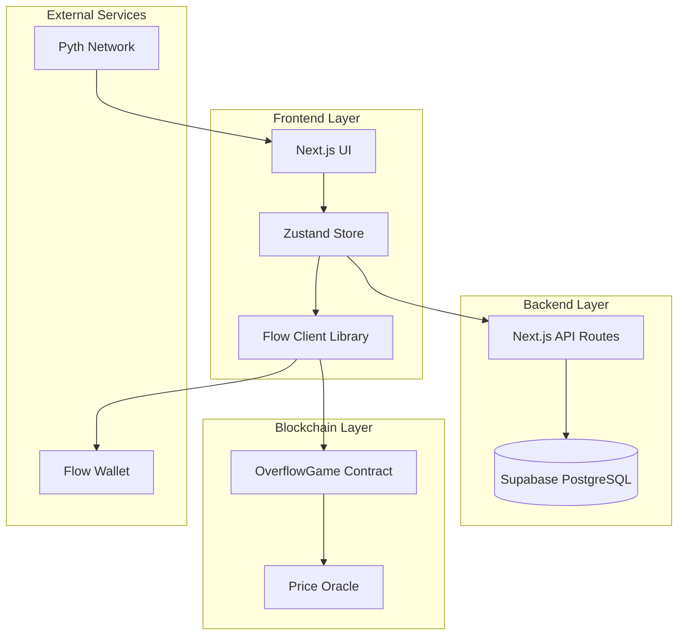
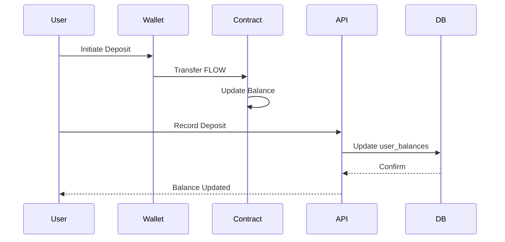
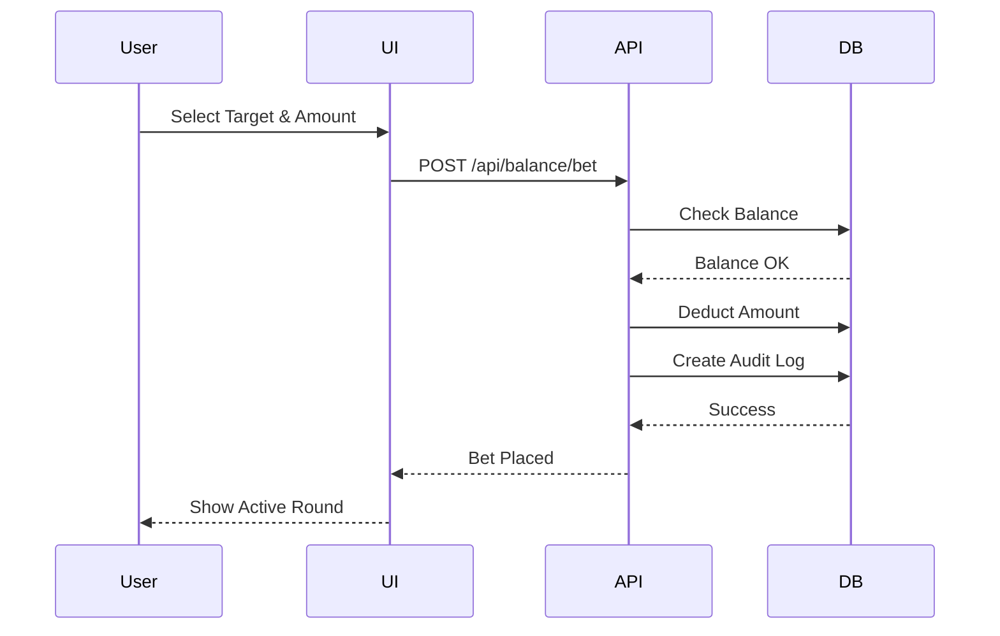
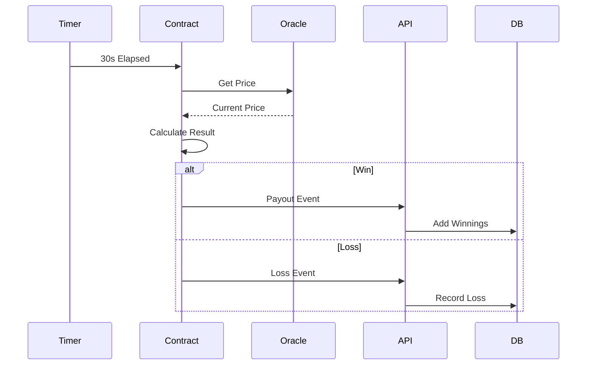
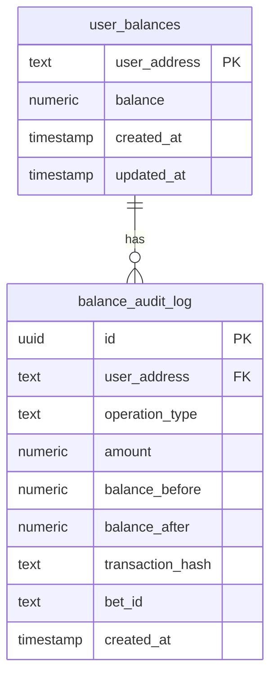
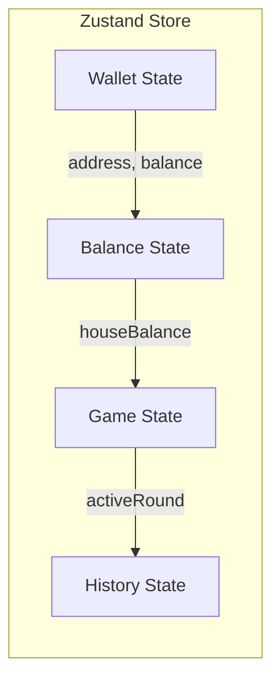

# Overflow

Decentralized BTC price prediction game on Flow Blockchain. Users deposit FLOW tokens into a house balance and place bets on Bitcoin price movements within 30-second rounds.

## Architecture Overview



## System Components

### 1. House Balance System

Users deposit FLOW tokens into a house balance stored in Supabase. Bets deduct from this balance without requiring wallet signatures for each bet.



### 2. Betting Flow



### 3. Settlement Flow



## Database Schema



## Tech Stack

- **Frontend**: Next.js 15, TypeScript, Tailwind CSS
- **State Management**: Zustand
- **Blockchain**: Flow Blockchain, Cadence
- **Database**: Supabase (PostgreSQL)
- **Price Feed**: Pyth Network
- **Charts**: Recharts

## Project Structure

```
overflow/
├── app/
│   ├── api/balance/          # Balance management endpoints
│   ├── layout.tsx
│   ├── page.tsx
│   └── providers.tsx
├── cadence/
│   ├── contracts/            # Smart contracts
│   ├── transactions/         # Transaction templates
│   ├── scripts/              # Query scripts
│   └── tests/                # Contract tests
├── components/
│   ├── balance/              # Balance UI components
│   ├── game/                 # Game UI components
│   ├── history/              # Bet history
│   └── ui/                   # Reusable components
├── lib/
│   ├── flow/                 # Flow integration
│   ├── store/                # State management
│   ├── supabase/             # Database client
│   └── utils/                # Utilities
├── supabase/
│   └── migrations/           # Database migrations
└── types/                    # TypeScript types
```

## Setup

### Prerequisites

- Node.js 18+
- Flow CLI
- Supabase account

### Installation

```bash
# Install dependencies
npm install

# Configure environment
cp .env.example .env.local
```

### Environment Variables

```env
# Flow Network
NEXT_PUBLIC_FLOW_NETWORK=testnet
NEXT_PUBLIC_TESTNET_ACCESS_NODE=https://rest-testnet.onflow.org
NEXT_PUBLIC_TESTNET_DISCOVERY_WALLET=https://fcl-discovery.onflow.org/testnet/authn
NEXT_PUBLIC_TESTNET_CONTRACT_ADDRESS=0xYOUR_CONTRACT_ADDRESS

# WalletConnect
NEXT_PUBLIC_WALLETCONNECT_PROJECT_ID=your_project_id

# Supabase
NEXT_PUBLIC_SUPABASE_URL=your_supabase_url
NEXT_PUBLIC_SUPABASE_ANON_KEY=your_anon_key

# App Config
NEXT_PUBLIC_APP_NAME=Overflow
NEXT_PUBLIC_ROUND_DURATION=30
NEXT_PUBLIC_PRICE_UPDATE_INTERVAL=1000
```

### Database Setup

```bash
# Apply migrations
npx supabase db push

# Verify setup
npm run verify:supabase
```

### Contract Deployment

```bash
# Generate Flow account
flow keys generate

# Deploy to testnet
flow project deploy --network=testnet
```

### Development

```bash
npm run dev
```

## API Endpoints

### Balance Management

```
GET  /api/balance/[address]     # Get user balance
POST /api/balance/deposit        # Record deposit
POST /api/balance/withdraw       # Record withdrawal
POST /api/balance/bet            # Place bet
POST /api/balance/payout         # Process payout
```

## Smart Contracts

### OverflowGame.cdc

Main game contract handling:
- Deposit/withdrawal from house balance
- Bet placement with multipliers
- Round settlement
- Payout processing

### Key Functions

```cadence
// Deposit FLOW to house balance
pub fun deposit(vault: @FlowToken.Vault): UFix64

// Withdraw FLOW from house balance
pub fun withdraw(amount: UFix64): @FlowToken.Vault

// Place bet from house balance
pub fun placeBetFromHouseBalance(
    targetCell: TargetCell,
    betAmount: UFix64,
    multiplier: UFix64,
    player: Address
): UInt64

// Settle round and determine winner
pub fun settleRound(betId: UInt64, caller: Address): SettlementResult
```

## State Management



### Store Slices

- **walletSlice**: Wallet connection, address, FLOW balance
- **balanceSlice**: House balance, deposit/withdraw operations
- **gameSlice**: Active rounds, betting, price updates
- **historySlice**: Bet history, past rounds

## Testing

```bash
# Frontend tests
npm test

# Contract tests
flow test --cover

# E2E tests
npm run test:e2e
```

## Deployment

### Testnet Deployment

```bash
# Deploy contracts
flow project deploy --network=testnet

# Build frontend
npm run build

# Deploy to Vercel
vercel deploy
```

### Production Checklist

- [ ] Deploy contracts to mainnet
- [ ] Configure production Supabase
- [ ] Set up monitoring
- [ ] Enable rate limiting
- [ ] Configure CDN
- [ ] Set up error tracking

## Security Considerations

1. **Balance Reconciliation**: Periodic sync between blockchain and database
2. **Atomic Operations**: Database transactions for balance updates
3. **Audit Logging**: All balance changes logged with transaction hashes
4. **Input Validation**: Server-side validation for all API requests
5. **Rate Limiting**: Prevent abuse of betting endpoints

## Performance Optimizations

- Real-time price updates via Pyth Network
- Optimistic UI updates for better UX
- Database indexes on user_address and created_at
- Connection pooling for Supabase
- Memoized React components

## Troubleshooting

### Balance Not Updating

```bash
# Check balance sync
npm run check:balance-sync

# Reconcile balance
npm run reconcile:balance
```

### Contract Deployment Issues

```bash
# Verify Flow CLI installation
flow version

# Check account configuration
flow accounts get 0xYOUR_ADDRESS --network=testnet
```

## Resources

- [Flow Documentation](https://developers.flow.com/)
- [Cadence Language](https://developers.flow.com/build/smart-contracts/cadence)
- [FCL Documentation](https://developers.flow.com/tools/clients/fcl-js)
- [Supabase Documentation](https://supabase.com/docs)
- [Pyth Network](https://pyth.network/)

## License

MIT
